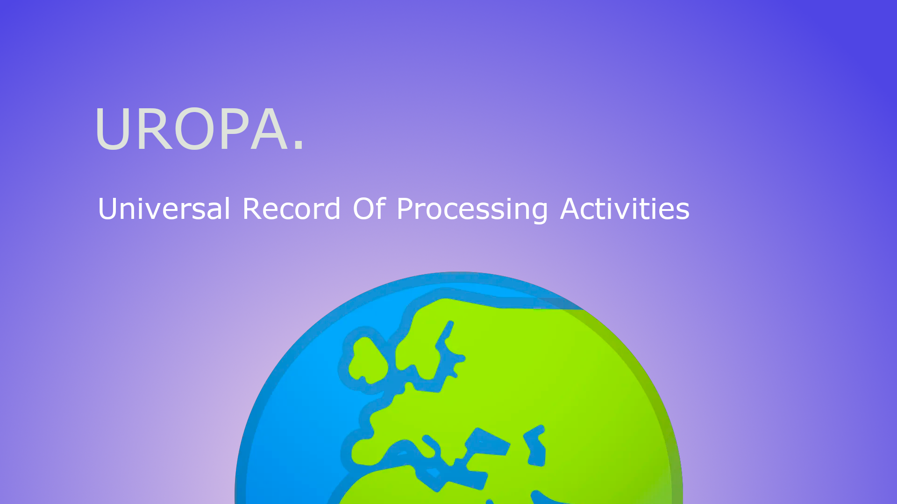

# Uropa
## Universal Record Of Processing Activities

# What is Uropa ? 

Uropa is a standardized protocol designed to help companies and their DPOs (or CPOs) to write and document data processing activities under a **machine readable format** while also respecting the legal requirements related to privacy laws all around the world.

It is inspired from the open API specification.

# Why Uropa ?

Technological industries are more and more subject to compliance with data protection laws all over the world requiring companies to be compliant and to be able to demonstrate their compliance. In particular, the GDPR requires companies to maintain records of processing activities (ROPA) that is a general reflection of the company’s processings. 

**We believe that ROPA are the cornerstone of the data protection process**. 

 

Because companies rely on static tools to maintain their ROPA (such as Excel sheet, yes we know 👁), their ROPA don’t reflect the reality of the company’s processing. Uropa aims to address this issue with a universal and interoperable machine-readable record of processing. 

Our goal is twofold. First, we want to empower companies to automatically assess whether their policies are really implemented and detect anomalies whether they use a self-made or a third-party compliance tool. Second, we want compliance tools and solutions to be interoperable, for companies to centralize their privacy solutions without useless and time consuming compatibility efforts. 

# How to use Uropa and who is it for ?

Uropa is meant to be used by persons editing data processing records. These persons could be :

* A techy/geek DPOs (Data protection officers, more often known as “Mr or Mrs GDPR ” within your team, wanting to document its processing activities directly in JSON (these are THE guys 👍)
* CTO’s in charge of GDPR (or copy-cat like laws) compliance (we love you too ❤️)
* Developers working on a solution to help companies maintain their compliance documentation (there a lot of them, yes we see you 👀).

Depending on who you are, Uropa is going to be used in different manners. 

As DPO or CTO wanting to just document your compliance, you’ll be able to write documents following the Uropa standards. Concretely, you’ll copy-paste the structure of a processing record from our github repository into your favorite IDE or text editor and you’ll save it in a JSON file (you, crazy person ! 🤯) . 

This way, you prepare for the future (Congrats 👏!). One day, when your company will want to enable the full power of data, you’ll be able to directly import all of your work in a global governance dedicated software solution. You’ll reuse all of the fruits of your efforts to adopt a DevRegOps approach. You will also prepare for the future team of Privacy engineers to take the floor and make their work easier because they’ll link the IT systems to your processing records, so that everything related to your privacy and data protection compliance becomes stateful (🏆).

As a Developer or a CTO of a company developing a software product (especially those aiming at editing processing records), you’ll be likely to love the unlimited possibilities of export and import that Uropa offers to you. Interoperability becomes real between other Processing records editing software and yours. 

Additionally, Processing records contain a lot of useful information for other types of software, including those related to cybersecurity or marketing. 

As a Developer working on a homemade project for your company, you might also want to automate or script some actions to complete a business workflow, be it related to privacy or not. To do so, you’ll be able to consume APIs providing information contained in processing records under a format respecting the Uropa standards.

With Uropa, you get the best of both worlds (🎤🎶), IT and legal, to serve your business and respect your customers’ privacy (so wonderful, isn’t it 🥲?).

# Technology and Documentation

Uropa is made of JSON only. No other technology is required to use this protocol. 

You’ll find all the useful documentation at this url : https://gdpr.stoplight.io/docs/uropa/branches/main/c2NoOjQ1ODgxNzk2-processing-record

All of the objects composing the processing record in its all are detailed in this documentation. 

# Community

If you want to participate in the project, or if you’re interested in making the work a more privacy respectful place, feel free to join our Developers and privacy Discord server here : https://discord.gg/EVr6ptb2s6

# Who Uropa is made by ?

Uropa is an open source project initially co-created by two french startups : Alias.dev and Leto.legal.

# License

Uropa standard is open source and may be used under the terms of the MIT License. 
